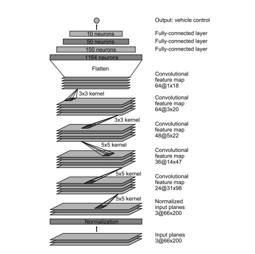

# Self-Driving Car Engineer Nanodegree

## Project: **Behavioral Cloning**

The goals / steps of this project are the following:

* Use the simulator to collect data of good driving behavior.

* Build, a convolution neural network in Keras that predicts steering angles from images.

* Train and validate the model with a training and validation set.

* Test that the model successfully drives around track one without leaving the road.

* Summarize the results with a written report


[//]: # (Image References)

[image1]: ./examples/placeholder.png "Model Visualization"
[image2]: ./examples/placeholder.png "Grayscaling"
[image3]: ./examples/placeholder_small.png "Recovery Image"
[image4]: ./examples/placeholder_small.png "Recovery Image"
[image5]: ./examples/placeholder_small.png "Recovery Image"
[image6]: ./examples/placeholder_small.png "Normal Image"
[image7]: ./examples/placeholder_small.png "Flipped Image"


## Rubric Points

---
### Files Submitted & Code Quality

#### 1. Submission includes all required files and can be used to run the simulator in autonomous mode

My project includes the following files:
* model.py: containing the script to create and train the model.
* drive.py: for driving the car in autonomous mode.
* model.h5: containing a trained convolution neural network. 
* video.mp4: cotaining a recorded lap run on autonomous mode around track 1.
* Behavioral_Cloning_Writeup.md: summarizing the results.

#### 2. Submission includes functional code
Using the Udacity provided simulator and my drive.py file, the car can be driven autonomously around the track by executing 
```sh
python drive.py model.h5
```

#### 3. Submission code is usable and readable

The model.py file contains the code for training and saving the convolution neural network. The file shows the pipeline I used for training and validating the model, and it contains comments to explain how the code works.

### Model Architecture and Training Strategy

#### 1. Model Overview

My model is based on the model provided by NVIDIA and used by Udacity throughout the lesson. The model architecture is detailed by NVIDIA [here](https://images.nvidia.com/content/tegra/automotive/images/2016/solutions/pdf/end-to-end-dl-using-px.pdf). The model originally takes a (60,266,3) image. However were provided (160,320,3) images. I kept the model architecture and preprocessed the input images as I will further explain later in this report. 

The model architecture is shown below:



#### 2. Loading the dataset

The dataset provided by Udacity has been used. Since OpenCV was used to load the images, and by default the images are read by OpenCV in BGR format, they were converted to RGB as drive.py processes in RGB format.

There is a steering angle associated with three images, thus I introduced a correction factor of 0.2 for left and right images since the steering angle is captured by the center angle. For the left images I increase the steering angle by 0.2 and for the right images I decrease the steering angle by 0.2.

A sample image is shown below:


#### 3. Preprocessing

The images were shuffled in order to avoid and bias by the order in which the CNN gets the images. 

The data was augmented by flipping the images horizontally and ajusting the steering angles accordingly. Therefore, I was able to generate 6 images corresponding to one single entry in the .csv file.

#### 4. Creation of the Training Set & Validation Set

From the Udacity Dataset I had 9 laps of track 1 with recovery data. This seemed to be enough to train the model. The dataset was split into training and validation sets using sklearn preprocessing library. I kept 15% of the data in the validation set and the remaining images in the training set.


I applied a generator to generate the data in order to avoid loading all the images in the memory and instead generate them at the run time in batches of 32. Even augmented images are generated inside the generators.

#### 5. Final Model Architecture

The original NVIDIA architecture has been modified, the final architecture is presented in the table below:

|           Layer (Type)           |             Output Shape             |
|----------------------------------|--------------------------------------|
| Lambda_3 (Lambda)                | (None, 160, 320, 3)                  |
| Cropping2d_3 (Cropping2D)        | (None, 65, 320, 3)                   |
| Convolution2d_11 (Convolution2D) | (None, 31, 158, 24)                  |
| Activation_17 (Activation)       | (None, 31, 158, 24)                  |
| Convolution2d_12 (Convolution2D) | (None, 14, 77, 36)                   |
| Activation_18 (Activation)       | (None, 14, 77, 36)                   |
| Convolution2d_13 (Convolution2D) | (None, 5, 37, 48)                    |
| Activation_19 (Activation)       | (None, 5, 37, 48)                    |
| Convolution2d_14 (Convolution2D) | (None, 3, 35, 64)                    |
| Activation_20 (Activation)       | (None, 3, 35, 64)                    |
| Convolution2d_15 (Convolution2D) | (None, 1, 33, 64)                    |
| Activation_21 (Activation)       | (None, 1, 33, 64)                    |
| Flatten_3 (Flatten)              | (None, 2112)                         |
| Dense_9 (Dense)                  | (None, 100)                          |
| Activation_22 (Activation)       | (None, 100)                          |          
| **Dropout_3 (Dropout)**          | (None, 100)                          |
| Dense_10 (Dense)                 | (None, 50)                           |
| Activation_23 (Activation)       | (None, 50)                           |
| Dense_11 (Dense)                 | (None, 10)                           |
| Activation_24 (Activation)       | (None, 10)                           |
| Dense_12 (Dense)                 | (None, 1)                            |

* From the table above, the first step was normalizing the input images.

* Then 70 pixels from the top and 25 pixels from the bottom of the images are cropped. The image was cropped from top because I did not wanted to distract the model with trees and sky and 25 pixels from the bottom so as to remove the dashboard that is coming in the images.

Sample Input Image:

   

Cropped Image:


* The third step was to define the first convolutional layer with filter depth as 24 and filter size as (5,5) with (2,2) stride followed by RELU activation function.
* Moving on to the second convolutional layer with filter depth as 36 and filter size as (5,5) with (2,2) stride followed by ELU activation function. 
* The third convolutional layer with filter depth as 48 and filter size as (5,5) with (2,2) stride followed by ELU activation function.
* Next we define two convolutional layer with filter depth as 64 and filter size as (3,3) and (1,1) stride followed by ELU activation funciton.
* Next step is to flatten the output from 2D to side by side.
* Here we apply first fully connected layer with 100 outputs.
* Here is the first time when I introduce dropout with dropout rate as 0.25 to avoid overfitting.
* Then I introduce the second fully connected layer with 50 outputs.
* Then comes a third connected layer with 10 outputs.
* And finally the layer with one output.

The final layer outputs just one value since what we need to predict is just the steering angle.

#### 6. Attempts to reduce overfitting in the model

I dropout layer was used after the fully-connected layer in order to prevent the model from overfitting. The dropout rate was set to 0.25.

#### 7. Model parameter tuning

From testing on track 1, the final model obtained is:

* No of epochs: 5.

* Optimizer: Adam.

* Learning Rate: 0.001.

* Validation data split: 0.15.

* Generator batch size: 32.

* Correction factor: 0.2

* Loss function: MSE (Mean Squared Error as it is efficient for regression problem).
